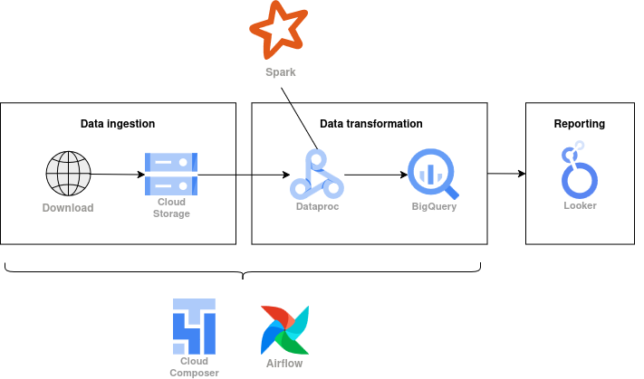

# Flight Data Engineering Zoomcamp Project

I have completed the final project from the Data Engineering Zoomcamp ([DataTalksClub/data-engineering-zoomcamp](https://github.com/DataTalksClub/data-engineering-zoomcamp/)). The goal was to download the public flights dataset, apply a scalable ETL pipeline, and build a dashboard on top of the transformed data.

## Project Overview




- **Dataset**: Bureau of Transportation Statistics (US): Airline On-Time Performance Data
- **Objective**:  
  1. Store raw flight data in a data lake (GCS buckets)  
  2. Transform and clean data using PySpark  
  3. Load cleaned data into a data warehouse (BigQuery)  
  4. Surface insights via BI dashboards  

## Technologies & Best Practices

- **Orchestration**: Apache Airflow  
- **Scalability**: PySpark for distributed ETL  
- **Infrastructure as Code**: Terraform to define GCS buckets, Dataproc clusters and BigQuery datasets  
- **CI/CD**: GitHub Actions to   
  - Apply Terraform (`plan` & `apply`)  
  - Deploy DAGs and dependencies to Composer (dev & prod)  
- **Dependency Management**:  
  - `requirements_local.txt` for local dev (conda/virtualenv)  
  - `requirements.txt` for GCP Composer in CI/CD  

## Airflow DAGs

- **Historical Backfill DAG**  
  - One-time run to rebuild the entire flight history  
  - Useful if you need to recover from errors or recreate most of the data  
- **Incremental Monthly DAG**  
  - Scheduled to run on the first of each month in production  
  - Processes only the newest monthly partition  

## Reproducibility

1. **Create a Python environment**  
   ```bash
   # Conda:
   conda create -n flights python=3.11
   conda activate flights

   # or virtualenv:
   python3.11 -m venv venv
   source venv/bin/activate

   pip install -r requirements_local.txt
   ```

2. **Provision the infrastructure with Terraform**  
   ```bash
   # Install Terraform ≥ 1.0 (https://developer.hashicorp.com/terraform/downloads)
   cd terraform                          # folder in this repo

   # Remote backend (GCS)
   # bucket  : name of the bucket created for the backend
   # prefix  : composer
   terraform init

   # Use an isolated workspace (e.g., "dev")
   terraform workspace new dev   # only the first time
   terraform workspace select dev

   # Review & create resources
   terraform plan
   terraform apply

3. **Create two Composer environments (CLI)**  
   
   ```bash
   # Dev
    gcloud composer environments create composer-dev \
    --location="${REGION}" \
    --project="${PROJECT_ID}" \
    --edition=STANDARD \
    --node-count=3 \
    --image-version=composer-3-airflow-2.9.0

    # Prod
    gcloud composer environments create composer-prod \
    --location="${REGION}" \
    --project="${PROJECT_ID}" \
    --edition=STANDARD \
    --node-count=3 \
    --image-version=composer-3-airflow-2.9.0
   ```
   **Alternative**: both environments could be fully codified using the google_composer_environment resource in Terraform for complete reproducibility.


## GCP Service Accounts & IAM Roles

Create three distinct service accounts in GCP, each with the following IAM roles:

1. **Composer Dev SA**  
   - Storage Admin  
   - Dataproc Admin  
   - Storage Object Admin  
   - Composer Editor  
   - Dataproc Worker  

2. **Composer Prod SA**  
   - Storage Admin  
   - Dataproc Admin  
   - Storage Object Admin  
   - Composer Editor  
   - Dataproc Worker  

3. **GitHub Actions CI/CD SA**  
   - Storage Admin  
   - BigQuery Admin  
   - Composer Admin  
   - Storage Object Admin  
   - Service Account Token Creator  


### Workload Identity Federation

Run the helper script **`setup_wif.sh`** (update the environment variables at the top) to create:

- A Workload Identity Pool  
- An OIDC provider restricted to your GitHub repository  
- A binding that lets the CI/CD service account impersonate via Workload Identity  

After executing the script, add these two **repository secrets** in GitHub Actions:

| Secret name     | Description                                  |
|-----------------|----------------------------------------------|
| `GCP_DEPLOY_SA` | Email of the service account to impersonate  |
| `GCP_WIF_PROVIDER` | Full resource name of the OIDC provider (e.g. `projects/123456/locations/global/workloadIdentityPools/github/providers/github-provider`) |

## Production Reporting

The live production dashboard is available here:  
[Looker Studio report](https://lookerstudio.google.com/reporting/4b675e0f-4448-40f4-ba12-4498717e5dd2)
